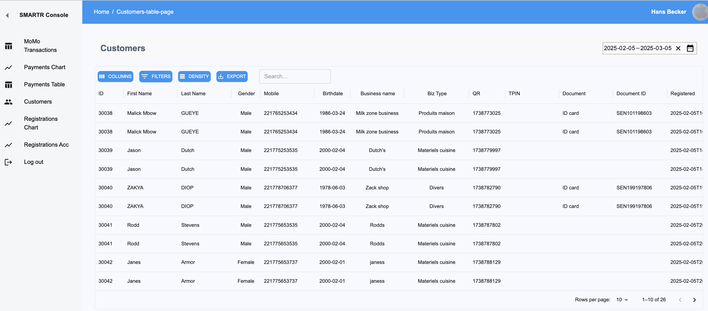

# Admin Console Overview

The **Admin Console** is designed to track payments, mobile money (MoMo) transactions, and customer (taxpayer) registrations.

To access it, open your browser and visit {== [https://console.smartr.cloud](https://console.smartr.cloud)==}. Log in using the credentials registered received when registering with **TAPx**.

---

## User Roles

The console supports two types of users:

- **Customer Admin**
- **Country Admin**

### Customer Admin

A **Customer Admin** can access all payments and registrations associated with their company.  
For instance, a municipality admin can view all relevant transactions within their domain.

Customers using **POSx** can access all payment data generated by the app. However, **registrations do not apply** to them.

### Country Admin

A **Country Admin** has full access to all payments, MoMo transactions, and registrations across the entire country.

**Access rights** for both roles are assigned by the **Country Manager**.

---

## Payments Chart

The **Payments Chart** is the first page users see upon logging in.  
Use the **Date Range Picker** in the upper-right corner to select a date range for analysis. By default, it displays data from the past month.

---

## Payments Table

The **Payments Table** presents the same data displayed in the **Payments Chart**, but in tabular format.

---

## MoMo Table

This table tracks all mobile money and other payment provider transactions.  
It contains all exchanged payment data, ensuring full transparency.

---

## Customers Table

The **Customers Table** lists all registered customers.  
Utilize **column filters** and the **search box** to quickly find relevant data.

Double-clicking a customer row opens their **profile page**, displaying essential details.  
Some fields are editable within this view.

---

## Registrations Charts

- **Left Chart**: Shows the number of registered customers (taxpayers) per day.
- **Right Chart**: Displays the cumulative number of registered customers over time.

          

---

## The Datagrid Toolbar

The tables in the console have a powerful toolbar for searching and filtering data.

- **Columns** Here you can define which columns should be visible in the datagrid.
- **Filters** Here you can filter the data to be shown in the grid. For example, show only customers/taxpayers with a surname that starts with _An_.
- **Density** Change the density of the rows in which the data is presented.
- **Export** For exporting the data in the grid to a csv-file.
- **Search** A searchbox for text search across all data in the grid.
