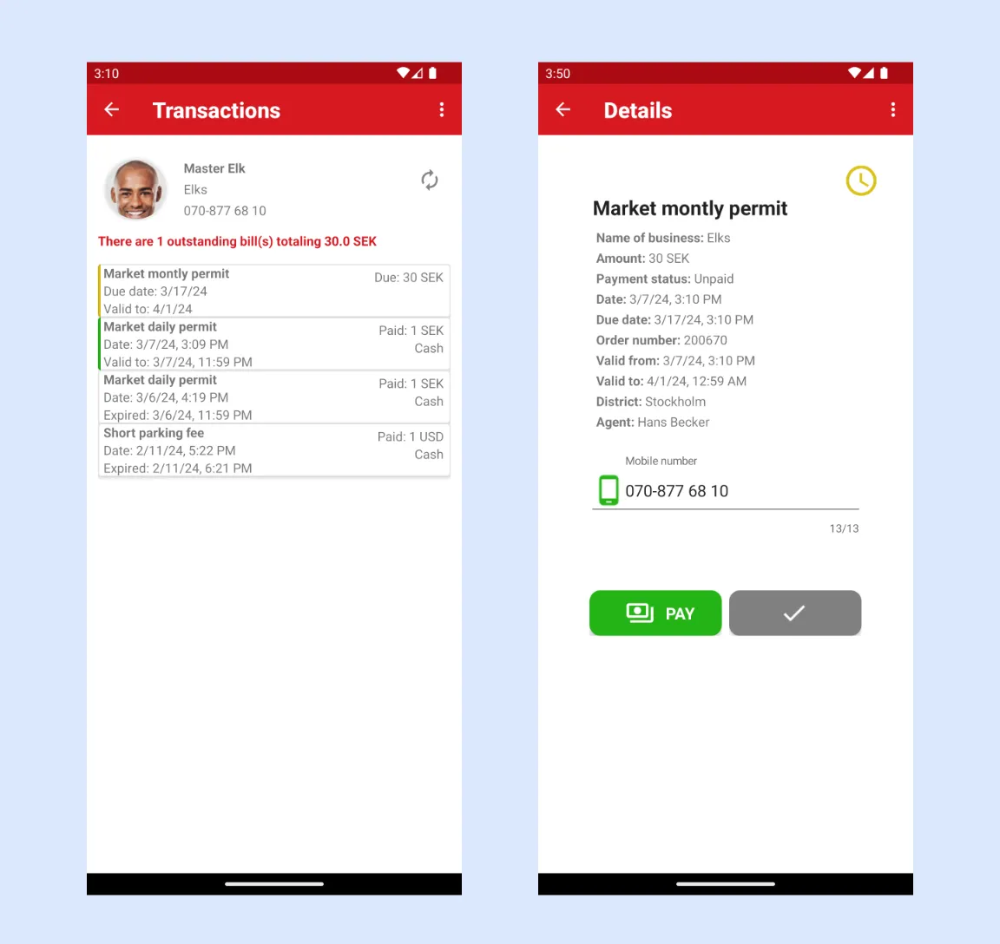

# Billy - BILL PAYMENT

{==

**Billy** - an app for bill management and payments.

**Target group:** People who receive bills from services in the SMARTr Cloud.

==}

**Billy** is an app designed to streamline bill management and payments. When new bills are issued, users receive instant notifications within the app. It offers a clear overview of all issued bills and enables users to easily initiate payments for any unpaid balances. Although originally created for taxpayers seeking better control over their tax payments, **Billy** also supports managing any bills generated via the **SMARTr Cloud** service, making it a versatile solution for a wide range of payment needs.

## Getting Started

The app is available for download from Google Play Store here: [https://play.google.com/store/apps/details?id=com.redflash.billy](https://play.google.com/store/apps/details?id=com.redflash.billy)

How to activate the app and to get access to your account:

1\. Enter your number and tap on activate.

2\. The app will send an SMS to itself. Tap on Proceed to continue the activation.

3\. **Billy** will start your messaging app with a pre-made SMS to be sent to itself. Send the SMS.

4\. You will be notified when the activation is complete. Tap on the notification to be directed to the page where you can see your transactions.

## Display QR Code

**Billy** can now display the taxpayer's QR code to be scanned by TAPx. Simply go to the menu with three dots and tap on “My QR-code.”

The user can sign out from the app by selecting Sign out from the menu in the upper right corner.

## Bill Notifications
When a tax agent or the system issues a bill with a deferred payment, the taxpayer is promptly notified through the **Billy** app. A notification is sent from **SMARTr Cloud** directly to the taxpayer's phone, appearing in the notification bar for easy access.

For example, an agent may schedule a payment due in 5 days. If the taxpayer has activated Billy, they will receive a timely notification about the upcoming payment. The taxpayer can then use **Billy** to initiate the payment at their convenience, ensuring they stay on top of their obligations without hassle.

