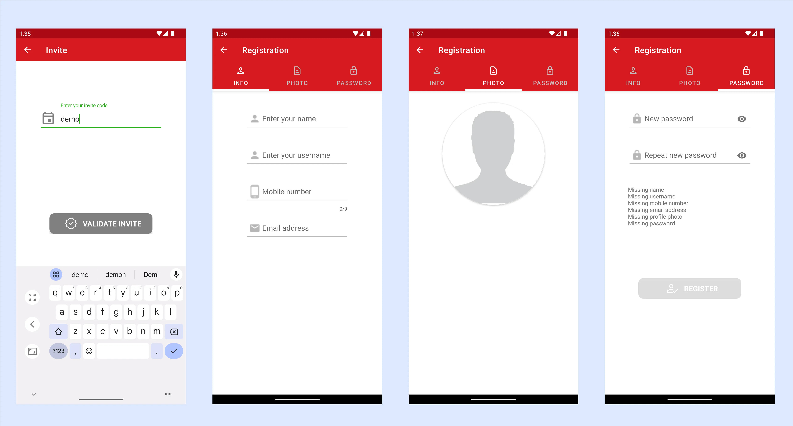

{==

**TAPx** - an app for agents collecting local taxes and fees.

==}

**TAPx** is a companion app to the SMARTr Cloud Service, a secure, mobile-first platform designed to simplify micro-taxation in Sub-Saharan Africa's dynamic informal sector. Integrated with leading mobile money services, SMARTr Tax efficiently handles high-volume transactions, recurring billing, and access control for time-limited virtual licences and permits. SMARTr Tax and **TAPx** empowers governments to streamline tax collection while reducing administrative costs.

## Main Functionality:

- Easy registration and modification of taxpayer information.
- Geolocation tagging to simplify locating taxpayers and businesses.
- Customer search via phone number, QR code, or map-based geographic location.
- Immediate permit/licence status checks.
- On-the-spot permit/licence issuance.
- Support recurring billing and deferred payments.
- Payment integration with supported mobile payment systems.

## Basic Concepts

**District:** A geographically defined area for tax collection (region, county, municipality). Districts are established at the project start. (Example on Google Maps: [https://mymaps.google.com](https://mymaps.google.com/))

**Articles:** Licences, permits, tariffs, or other non-tangible items with defined validity periods (e.g., yearly, monthly, daily). Articles with prices are district-specific and are determined at project initiation.

**Business Types:** Categories for classifying businesses (e.g., café, gas station, bank, barber, pharmacy, restaurant, fruit/vegetable stand).

**Orders/Transactions** Every transaction in the system has an order number to be referred to. The order is linked to an article that has been sold/issued.

## Getting Started

**Download:** Find the app on the Google Play Store ([https://play.google.com/store/apps/details?id=com.redflash.tapx](https://play.google.com/store/apps/details?id=com.redflash.tapx))

**Login:** The login screen displays your position and the current app version.

**Potential issue when starting:** TAPx relies on a functional phone GPS. If the GPS malfunctions, the app will alert you and shut down. To resolve this, open Google Maps, then relaunch TAPx.

## Account Creation

Self-registration is possible using an invite code (obtain it from your manager). The invite code links your user data to the appropriate organisation.

To create an account, follow the steps below:

1.  Click the black "Register" button on the login page.
2.  Enter your invite code.
3.  Provide personal data (name, username, mobile number, email). Usernames must be unique.
4.  Upload a clear headshot photo.
5.  Create a password (minimum five characters, including one special character and one digit). If any data is missing, you will see a notification about this on the password page.
6.  Click the "Register" button (it will turn green when all data is valid).
7.  Await manager approval before logging in.

Access pages to modify your information through the drawer menu (hamburger menu) in the upper left corner

## Home Screen

{align=right}

**Main Options:**

**Search for a Taxpayer:** There are multiple ways to search for a taxpayer: you can search by phone number (tap the search icon), by ID card (tap the document scan icon), or by QR code (tap the QR code icon). The available search options are configured during the initial setup and may vary depending on customer-specific requirements.

**Add a New Taxpayer:** Tap the "Add" button.

**Cart:** Tap for issuing permits.

**Transactions:** See and manage transactions of the customer.

**Payments:** Tap the "Payments" button to view processed payments.

**Map:** Tap the "Map" button to see registered customer locations within your district.

## Register and Modify of Taxpayer Information

**Data Entry (Screen 1):** Enter the taxpayer's name, family name, and gender. Take a clear headshot photo with good lighting. After accepting the photo, you can crop it accordingly.

**Info (Screen 2):** Provide personal information (birthday, mobile number, email).

**Business Info (Screen 3):** Enter the Taxpayer Identification Number (TPIN), and business name, and select the business type. Preview and save the data when complete.

## Link a QR-code to the taxpayer

When registering a taxpayer you might want to link an existing QR-code to the tax payer. Just tap the Qr-code field. The camera starts and you can scan the new QR-code. The code is read and will be saved if you save the data of the tax payer. If you want to change the QR-code, just tap the QR code field and scan again.

## Scanning ID-Cards

TAPx supports the scanning of ID cards and two formats are supported: MRZ (machine readable zone) and PDF417. The functionality of ID-card scanning is optional and must be activated by Redflash.

## Issue and Sell Licences and Permits

**1. Identify Taxpayer:** Use the Search function to find the taxpayer. You can either scan their QR code or search by phone number. If the search is successful, you will land on the customer page where all relevant customer data are presented. If the taxpayer has a valid permit, it is shown on this page.

**2.** Goto the **Home Page** and tap **Cart**.

**3. Articles Page**: Select the relevant district from the dropdown menu to see available articles. Choose an article and confirm.

**4. Payment page:** verify the selected article, price and the mobile number for payment. If ok, tap "PAY". If credit is given, tap "LATER" for deferred payment.

## Transaction History and License/Permit Validity Checks

The transaction button becomes active when the taxpayer has a registered active transaction. It may also display a badge indicating the number of active transactions, with yellow for deferred payments and red for unpaid orders. By tapping the transaction button, users can view and manage these transactions.

Transactions highlighted in green represent active permits/licences. Yellow indicates active transactions with deferred payments, while red marks unpaid transactions.

A warning message will appear if there are any unpaid orders. These can be settled directly from the order details page.

By long-pressing a transaction in the list, you can view detailed transaction information. If the order remains unpaid, easily initiate the payment process by tapping the 'Pay' button.

## Google Maps Integration

Google Maps is well integrated into the app. If you tap the Maps button on the home screen, the app will show your location on the map. If you zoom out, you will see your district boundaries as shown in the left screenshot. If you have a taxpayer selected, the map will show the location of the taxpayer on the map. If you tap on the marker of the taxpayer, a small info window will pop up and show you the basic info.

Tapping on the red head shows all merchants with invalid licences/permits.

Tapping on the green head shows all merchants with valid licences/permits.

Tapping on the yellow head shows you all merchants with outstanding payments.

Below are two examples of info windows for merchants with valid permits and outstanding payments.

When tapping on a marker in the map you see detailed information about the merchant.

Tapping on the info window of the marker takes you back to the home page with the merchant selected. You can now view more detailed information about the merchant.

Tapping on the yellow head shows you all merchants with deferred payments.

If you have a merchant selected on the home page, you can locate the merchant as usual by tapping on the map button.

## User Management

Before a user can access the system, he needs to be approved by either an administrator or a manager of the organisation. Isaac and Gibson have admin rights for their countries. As an admin, you can approve or deactivate a user in the country. A manager only has access to users in his organisation.

Access to the user management page can be found in the side menu under the option Users. Only users with the appropriate permissions will be able to see this option.

On the User Management page, you can activate users who have registered (green icon), and you can also deactivate users (black icon). There is also a deletion option (red icon) that you should use carefully.

## My Registrations

On the “My registrations” page you can see statistics of how many registrations you have done per day, this week, last week, this month or the previous month.

You can now see all the merchants that you have registered and search in the list.  Tap on a customer that has been registered and see all his info.

## Related Products

**Billy:** Bill management and payment

**POSx:** Point of sales payments

**PARKx:** Parking attendant app

**SMARTR CLOUD:** Cloud services supporting the apps
