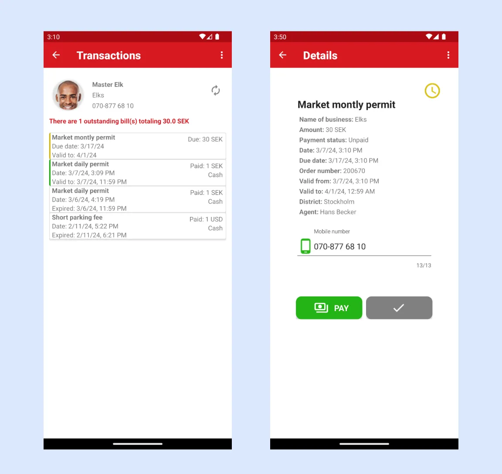
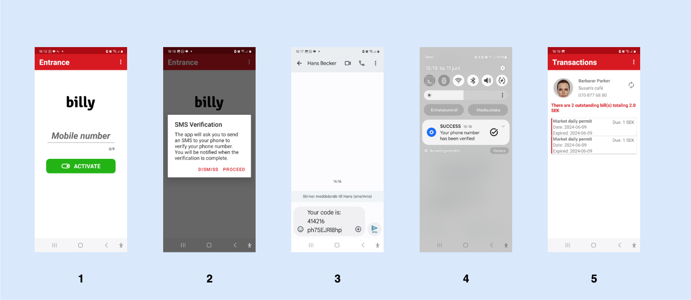
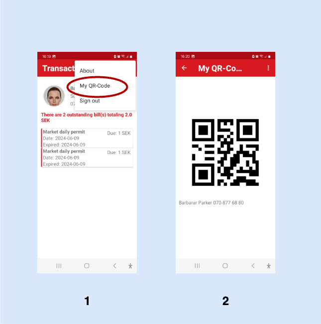

# Billy - PAIEMENT DE FACTURES

{==

**Billy** - une application pour la gestion et le paiement des factures.

**Public cible :** Les personnes qui reçoivent des factures de services dans le SMARTr Cloud.

==}

**Billy** est une application conçue pour simplifier la gestion et le paiement des factures. Lorsque de nouvelles factures sont émises, les utilisateurs reçoivent des notifications instantanées dans l'application. Elle offre une vue claire de toutes les factures émises et permet aux utilisateurs de lancer facilement des paiements pour tout solde impayé. Bien qu'initialement créée pour les contribuables cherchant à mieux contrôler leurs paiements d'impôts, **Billy** prend également en charge la gestion de toutes les factures générées via le service **SMARTr Cloud**, en faisant une solution polyvalente pour un large éventail de besoins de paiement.

## Commencer

L'application est disponible en téléchargement sur le Google Play Store ici : [https://play.google.com/store/apps/details?id=com.redflash.billy](https://play.google.com/store/apps/details?id=com.redflash.billy)

Comment activer l'application et accéder à votre compte :

1. Entrez votre numéro et appuyez sur activer.

2. L'application enverra un SMS à elle-même. Appuyez sur Procéder pour continuer l'activation.

3. **Billy** ouvrira votre application de messagerie avec un SMS prérempli à envoyer à elle-même. Envoyez le SMS.

4. Vous serez notifié lorsque l'activation sera terminée. Appuyez sur la notification pour être dirigé vers la page où vous pouvez voir vos transactions.

## Afficher le code QR

**Billy** peut désormais afficher le code QR du contribuable à scanner par TAPx. Il suffit d'aller dans le menu avec trois points et d'appuyer sur "Mon code QR".

L'utilisateur peut se déconnecter de l'application en sélectionnant Se déconnecter dans le menu en haut à droite.

## Notifications de Factures

Lorsqu'un agent fiscal ou le système émet une facture avec un paiement différé, le contribuable est rapidement notifié via l'application **Billy**. Une notification est envoyée depuis **SMARTr Cloud** directement au téléphone du contribuable, apparaissant dans la barre de notification pour un accès facile.

Par exemple, un agent peut planifier un paiement dû dans 5 jours. Si le contribuable a activé Billy, il recevra une notification en temps utile concernant le paiement à venir. Le contribuable peut alors utiliser **Billy** pour initier le paiement à sa convenance, s'assurant ainsi de respecter ses obligations sans tracas.

