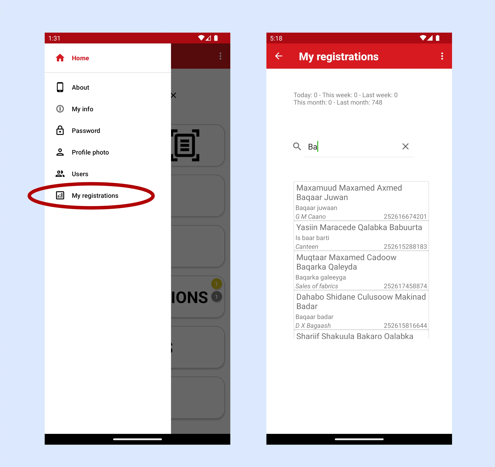

---

title: "TAPx - Guide de l'utilisateur de l'application Tax Agent"

---

{==

**TAPx** - une application pour les agents collectant des taxes et des frais locaux.

==}

**TAPx** est une application complémentaire au service cloud SMARTr, une plateforme sécurisée et mobile conçue pour simplifier la micro-taxation dans le secteur informel dynamique de l'Afrique subsaharienne. Intégrée aux principaux services de paiement mobile, SMARTr Tax gère efficacement les transactions à volume élevé, la facturation récurrente et le contrôle d'accès pour les licences et permis virtuels temporisés. SMARTr Tax et **TAPx** permettent aux gouvernements de rationaliser la collecte des taxes tout en réduisant les coûts administratifs.

## Fonctionnalités principales :

*   Inscription et modification faciles des informations des contribuables.
*   Marquage de géolocalisation pour simplifier la localisation des contribuables et des entreprises.
*   Recherche de clients par numéro de téléphone, QR code ou localisation géographique basée sur la carte.
*   Vérifications immédiates du statut des permis/licences.
*   Délivrance de permis/licences sur place.
*   Support de la facturation récurrente et des paiements différés.
*   Intégration de paiements avec les systèmes de paiement mobile pris en charge.

## Concepts de base

**District :** Une zone géographiquement définie pour la collecte des taxes (région, comté, municipalité). Les districts sont établis au début du projet. (Exemple sur Google Maps : [https://mymaps.google.com](https://mymaps.google.com/))

**Articles :** Licences, permis, tarifs ou autres articles non tangibles avec des périodes de validité définies (par exemple, annuel, mensuel, quotidien). Les articles avec prix sont spécifiques au district et sont déterminés au début du projet.

**Types d'entreprises :** Catégories pour classer les entreprises (par exemple, café, station-service, banque, salon de coiffure, pharmacie, restaurant, stand de fruits/légumes).

**Commandes/Transactions :** Chaque transaction dans le système a un numéro de commande qui lui est attribué. La commande est liée à un article qui a été vendu/délivré.

## Commencer

**Télécharger :** Trouvez l'application sur le Google Play Store ([https://play.google.com/store/apps/details?id=com.redflash.tapx](https://play.google.com/store/apps/details?id=com.redflash.tapx))

**Connexion :** L'écran de connexion affiche votre position et la version actuelle de l'application.

**Problème potentiel lors du démarrage :** TAPx dépend d'un GPS fonctionnel sur le téléphone. Si le GPS ne fonctionne pas, l'application vous alertera et se fermera. Pour résoudre ce problème, ouvrez Google Maps, puis relancez TAPx.

## Création de compte

L'auto-inscription est possible en utilisant un code d'invitation (obtenez-le auprès de votre responsable). Le code d'invitation lie vos données utilisateur à l'organisation appropriée.

Pour créer un compte, suivez les étapes ci-dessous :

1.  Cliquez sur le bouton noir "S'inscrire" sur la page de connexion.
2.  Entrez votre code d'invitation.
3.  Fournissez des données personnelles (nom, prénom, numéro de mobile, email). Les noms d'utilisateur doivent être uniques.
4.  Téléchargez une photo de profil claire.
5.  Créez un mot de passe (minimum cinq caractères, incluant un caractère spécial et un chiffre). Si des données sont manquantes, vous recevrez une notification à ce sujet sur la page du mot de passe.
6.  Cliquez sur le bouton "S'inscrire" (il deviendra vert lorsque toutes les données seront valides).
7.  Attendez l'approbation du responsable avant de vous connecter.

Accédez aux pages pour modifier vos informations via le menu latéral (menu hamburger) dans le coin supérieur gauche.

## Écran d'accueil

{align=right}

**Options principales :**

**Rechercher un contribuable :** Il existe plusieurs façons de rechercher un contribuable : vous pouvez rechercher par numéro de téléphone (tapez sur l'icône de recherche), par carte d'identité (tapez sur l'icône de scan de document) ou par QR code (tapez sur l'icône QR code). Les options de recherche disponibles sont configurées lors de la configuration initiale et peuvent varier en fonction des exigences spécifiques du client.

**Ajouter un nouveau contribuable :** Tapez sur le bouton "Ajouter".

**Panier :** Tapez pour émettre des permis.

**Transactions :** Voir et gérer les transactions du client.

**Paiements :** Tapez sur le bouton "Paiements" pour consulter les paiements traités.

**Carte :** Tapez sur le bouton "Carte" pour voir les emplacements des clients enregistrés dans votre district.

## Enregistrement et modification des informations du contribuable

**Saisie de données (Écran 1) :** Entrez le nom, le prénom et le sexe du contribuable. Prenez une photo de profil claire avec un bon éclairage. Après avoir accepté la photo, vous pouvez la recadrer en conséquence.

**Info (Écran 2) :** Fournissez des informations personnelles (date de naissance, numéro de mobile, email).

**Info entreprise (Écran 3) :** Entrez le Numéro d'Identification du Contribuable (TPIN), le nom de l'entreprise, et sélectionnez le type d'entreprise. Prévisualisez et enregistrez les données une fois complètes.

## Scannage des cartes d'identité

TAPx supporte le scan des cartes d'identité et deux formats sont pris en charge : MRZ (zone lisible par machine) et PDF417. La fonctionnalité de scan de carte d'identité est optionnelle et doit être activée par Redflash.

## Émission et vente de licences et permis

**1. Identifier le contribuable :** Utilisez la fonction de recherche pour trouver le contribuable. Vous pouvez soit scanner leur QR code, soit rechercher par numéro de téléphone. Si la recherche est réussie, vous accéderez à la page client où toutes les données pertinentes sont présentées. Si le contribuable a un permis valide, il est affiché sur cette page.

**2.** Allez à la **Page d'accueil** et appuyez sur **Panier**.

**3. Page des articles :** Sélectionnez le district pertinent dans le menu déroulant pour voir les articles disponibles. Choisissez un article et confirmez.

**4. Page de paiement :** vérifiez l'article sélectionné, le prix et le numéro de mobile pour le paiement. Si tout est correct, tapez sur "PAYER". Si un crédit est accordé, tapez sur "PLUS TARD" pour un paiement différé.

## Historique des transactions et vérifications de validité des licences/permis

Le bouton de transaction devient actif lorsque le contribuable a une transaction active enregistrée. Il peut également afficher un badge indiquant le nombre de transactions actives, avec du jaune pour les paiements différés et du rouge pour les commandes non réglées. En appuyant sur le bouton de transaction, les utilisateurs peuvent visualiser et gérer ces transactions.

Les transactions surlignées en vert représentent des permis/licences actifs. Le jaune indique des transactions actives avec des paiements différés, tandis que le rouge marque des transactions non réglées.

Un message d'avertissement apparaîtra s'il y a des commandes non réglées. Celles-ci peuvent être réglées directement depuis la page des détails de la commande.

En maintenant une pression longue sur une transaction dans la liste, vous pouvez voir des informations détaillées sur la transaction. Si la commande reste impayée, lancez facilement le processus de paiement en appuyant sur le bouton 'Payer'.

## Intégration de Google Maps

Google Maps est bien intégré dans l'application. Si vous appuyez sur le bouton Maps sur l'écran d'accueil, l'application affichera votre position sur la carte. Si vous zoomez, vous verrez les limites de votre district comme montré dans la capture d'écran de gauche. Si vous avez un contribuable sélectionné, la carte affichera sa localisation. Si vous appuyez sur le marqueur du contribuable, une petite fenêtre d'information apparaîtra avec les informations de base.

Appuyer sur la tête rouge montre tous les commerçants avec des licences/permis invalides.

Appuyer sur la tête verte montre tous les commerçants avec des licences/permis valides.

Appuyer sur la tête jaune montre tous les commerçants avec des paiements en attente.

Voici deux exemples de fenêtres d'information pour les commerçants avec des permis valides et des paiements en attente.

Lorsque vous appuyez sur un marqueur sur la carte, vous voyez des informations détaillées sur le commerçant.

Appuyer sur la fenêtre d'information du marqueur vous ramène à la page d'accueil avec le commerçant sélectionné. Vous pouvez maintenant voir des informations plus détaillées sur le commerçant.

Appuyer sur la tête jaune montre tous les commerçants avec des paiements différés.

Si vous avez un commerçant sélectionné sur la page d'accueil, vous pouvez le localiser comme d'habitude en appuyant sur le bouton de la carte.

## Gestion des utilisateurs

Avant qu'un utilisateur puisse accéder au système, il doit être approuvé par un administrateur ou un responsable de l'organisation. Isaac et Gibson ont des droits d'administration pour leurs pays. En tant qu'administrateur, vous pouvez approuver ou désactiver un utilisateur dans le pays. Un responsable n'a accès qu'aux utilisateurs de son organisation.

L'accès à la page de gestion des utilisateurs se trouve dans le menu latéral sous l'option Utilisateurs. Seuls les utilisateurs avec les permissions appropriées pourront voir cette option.

Sur la page de gestion des utilisateurs, vous pouvez activer les utilisateurs qui se sont inscrits (icône verte), et vous pouvez également désactiver des utilisateurs (icône noire). Il y a aussi une option de suppression (icône rouge) que vous devez utiliser avec précaution.

## Mes inscriptions

Sur la page "Mes inscriptions", vous pouvez voir des statistiques sur le nombre d'inscriptions que vous avez effectuées par jour, cette semaine, la semaine dernière, ce mois-ci ou le mois précédent.

Vous pouvez maintenant voir tous les commerçants que vous avez enregistrés et rechercher dans la liste. Tapez sur un client qui a été enregistré et voyez toutes ses informations.

## Produits connexes

**Billy :** Gestion et paiement des factures

**POSx :** Paiements aux points de vente

**PARKx :** Application pour agents de stationnement

**SMARTR CLOUD :** Services cloud soutenant les applications